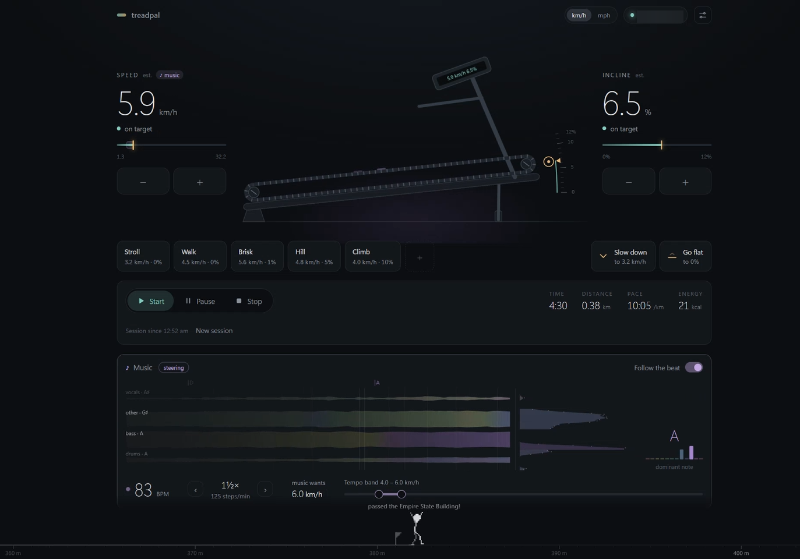

# TreadPal

BLE treadmill controller with BPM-synced speed. Connects to FTMS treadmills and matches your speed to the music's tempo using a biomechanical stride model.



## How it works

- **Server** (near the treadmill): BLE/FTMS control, [beat_this](https://github.com/CPJKU/beat_this) beat detection, speed sync, web UI. Splits the music into vocals, other, bass and drums in real time with a streaming [HS-TasNet](https://arxiv.org/abs/2402.17701) ([vendored](src/treadpal/vendor/hs_tasnet/README.md)).
- **Agent** (`bpm_agent.py`, on the machine playing music): streams system audio and spectrum frames to the server.

BPM sync picks the beat harmonic (½×, 1×, 2×…) whose implied stride is most natural within your speed range, then ramps the belt toward it.

## Setup

```bash
uv sync
uv run treadpal          # http://127.0.0.1:8080/  (API docs at /docs)
TREADPAL_SIMULATE=1 uv run treadpal   # no treadmill? use a simulated one
```

On the music machine (needs `uv`):

```bash
uv run bpm_agent.py --server ws://<server-ip>:8080/ws/audio
```

Windows uses WASAPI loopback, Linux a PulseAudio/PipeWire monitor, macOS needs [BlackHole](https://github.com/ExistentialAudio/BlackHole).

## Web UI

- Drag the belt for speed and the handle for incline, tap a number to type it, or use `+`/`−`, presets, **Slow down** and **Go flat**. Keys: `↑`/`↓` speed, `Shift`+`↑`/`↓` incline, `S`, `F`, `Space`, `Esc`.
- Actual values are mint, targets amber.
- The music panel shows each stem as a ribbon coloured by its own dominant note, with beats, bar lines and chord changes.
- A pixel walker paces you along a distance ruler of landmarks, stepping at the modelled cadence on the beat. With music it dances to the beat, picking moves by the dominant note.
- Sessions are saved in the browser. If the treadmill resets within 10 minutes, you can resume.

## Configuration

`treadpal.json` (common keys also work as `TREADPAL_<KEY>` environment variables):

```json
{
    "host": "0.0.0.0",
    "port": 8080,
    "speed_send_mph": false,
    "bpm_min_speed_kmh": 4.0,
    "bpm_max_speed_kmh": 7.0,
    "bpm_harmonics": [0.25, 0.5, 1.0, 2.0, 4.0],
    "stems": true,
    "log_level": "info"
}
```

- Some treadmills report their *target* speed and incline instead of the live values. TreadPal detects this and estimates the real motion (marked "est."). Tune with `motion_speed_rate_kmh_s` and `motion_incline_rate_pct_s`.
- `log_level: "debug"` logs every BLE packet and command. Recent traffic is also at `GET /api/debug/ble`.
- If audio reaches you late (e.g. Bluetooth headphones), use **Beat offset** in the UI settings.

## API

| Endpoint | Description |
|---|---|
| `GET /api/status` | Connection, live data, targets, ranges |
| `POST /api/control/start\|stop\|pause` | Treadmill lifecycle |
| `POST /api/control/set_speed` / `set_incline` | `{"value": 5.0}` (km/h, %) |
| `POST /api/bpm/update` | `{"bpm": 140}` from any source |
| `GET /api/bpm/status`, `PUT /api/bpm/config` | BPM sync state and settings |
| `WS /ws/audio?sr=44100&ch=2` | Audio (float32) and visualiser frames from the agent |
| `WS /ws/viz` | Visualiser, stem and beat frames for the UI |
| `GET /api/history` | Logged workout data |
